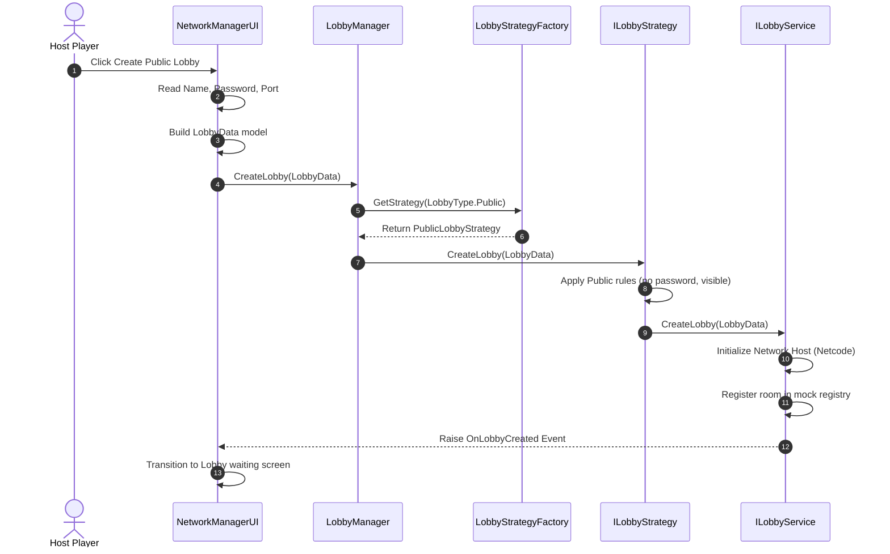
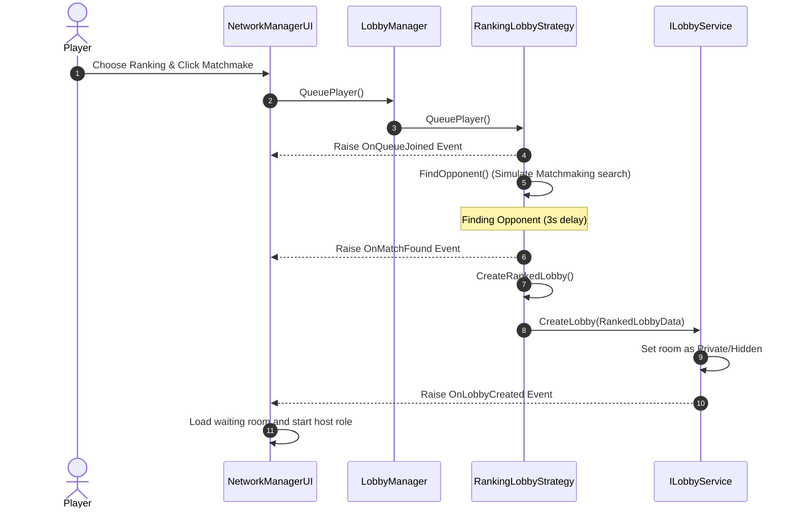

# CaroGame Lobby Architecture (Clean Architecture & SOLID)

This document outlines the refactored, decoupled architecture of the CaroGame Lobby system.

## 1. System Design Diagram

The architecture is split into clean boundaries using **Clean Architecture** principles:
- **Presentation Layer**: Collects player input, displays current sảnh states, and reacts to events.
- **Application Core (Domain Layer)**: Governs lobby lifecycle and routes commands via the Strategy Pattern.
- **Infrastructure Layer (Data Layer)**: Communicates with network socket drivers or mock data storage.

```mermaid
graph TD
    subgraph Presentation
        NMUI[NetworkManagerUI]
        LUI[LobbyUI]
    end

    subgraph Application Core (Domain)
        LM[LobbyManager]
        LSF[LobbyStrategyFactory]
        ILS[ILobbyStrategy]
        
        PublicStrat[PublicLobbyStrategy]
        PrivateStrat[PrivateLobbyStrategy]
        RankingStrat[RankingLobbyStrategy]
        
        LData[LobbyData]
        LType[LobbyType]
    end

    subgraph Infrastructure (Data)
        SL[ServiceLocator]
        ILServ[ILobbyService]
        
        UnityLServ[UnityLobbyService]
        MockLServ[MockLobbyService]
        Netcode[Unity Netcode / Transport]
    end

    NMUI --> LM
    LUI --> LM
    LM --> LSF
    LSF --> ILS
    
    ILS <|.. PublicStrat
    ILS <|.. PrivateStrat
    ILS <|.. RankingStrat
    
    PublicStrat --> ILServ
    PrivateStrat --> ILServ
    RankingStrat --> ILServ

    SL --> ILServ
    ILServ <|.. UnityLServ
    ILServ <|.. MockLServ

    UnityLServ --> Netcode
```

---

## 2. Dependency Rules

To satisfy **Dependency Inversion**, all high-level business rules (strategies, managers) depend exclusively on the abstract interfaces (`ILobbyStrategy` and `ILobbyService`), rather than concrete transport implementations (`NetworkManager` or `MockLobbyService`).
Service resolution is handled dynamically through a lightweight `ServiceLocator` bootstrapper, eliminating hardcoded service instantiation.

---

## 3. Key Class Responsibilities

| Class Name | Layer | Responsibility |
| :--- | :--- | :--- |
| `LobbyType` | Domain | Enum specifying Public, Private, or Ranking lobby modes. |
| `LobbyData` | Domain | Data model encapsulating lobby configurations (Name, Type, Max Players, Password, Invite Code). |
| `ILobbyStrategy` | Domain | Strategy interface defining lobby configuration validation and setup rules. |
| `LobbyStrategyFactory` | Domain | Factory returning the concrete strategy based on `LobbyType`, removing conditional checks. |
| `LobbyManager` | Domain | Singleton domain controller serving as the single entry point for UI scripts. |
| `ILobbyService` | Infrastructure | Interface defining the backend operations (creating, joining, leaving rooms) and exposing notification events. |
| `ServiceLocator` | Infrastructure | Static registry handling resolution of concrete backend dependencies. |
| `UnityLobbyService` | Infrastructure | Implements `ILobbyService` using Unity Netcode and Transport. |
| `MockLobbyService` | Infrastructure | Implements `ILobbyService` using a local JSON file to simulate lobby listings across offline builds. |

---

## 4. Operational Sequence Flows

### A. Lobby Creation Flow



### B. Matchmaking Flow (Ranking)


